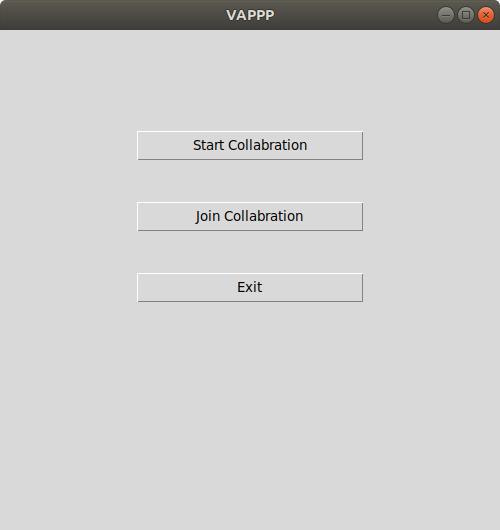
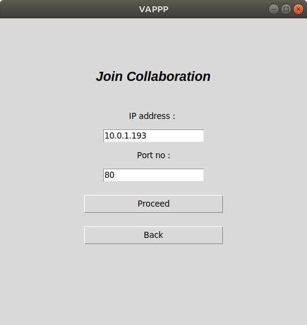

# Project-VAPPP
### What is Project-VAPPP (Offline Share)?

Project-VAPPP enables a team to quickly collaborate on the same document without the need of Internet Connection. However, they need to be connected on the same network.


## On Windows

clone the repository in xampp/htdocs
### Installation
Firstly install Node.js

```sh
$ cd Socket
$ npm install
```

## On Ubuntu
Clone the repository in '/var/html/www'

### Installation
Requirements :
* Node.js
* Python Tkinter
* Socket.io 
* Javascript

```sh
$ cd Socket
$ npm install 
```

### Running:
```sh 
$ cd Project-VAPPP
$ cd Python
$ python3 app.py
```
<br>
<p align="center">
  
</p>
<br>
**To Start Collaboration**
<br>
Click on Start Collaboration
<br>
<p align="center">
  
</p>
<br>
then 
Click 'Proceed'
**To Join Collaboration**
Click on 'Join Collaboration'
<br>
<p align="center">
  
</p>
<br>
<p>
Enter IP address (server PC IP address) 
</p>
  
