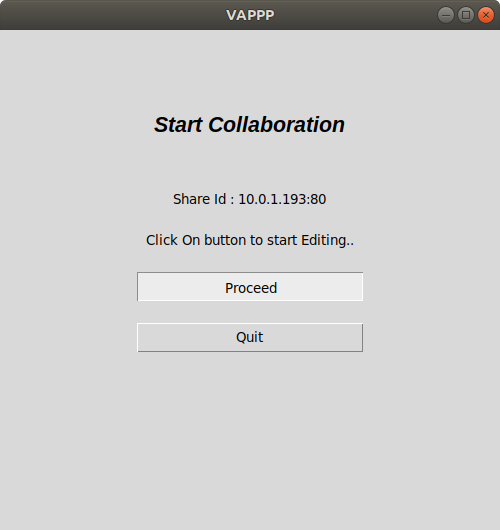

# Project-VAPPP
What is Project-VAPPP (Offline Share)?

Project-VAPPP enables a team to quickly collaborate on the same document without the need of Internet Connection. However, they need to be connected on the same network.

## On Windows

clone the repository in xampp/htdocs
### Installation
'''
Firstly install Node.js
cd Socket
npm install
'''

## On Ubuntu
clone the repository in '/var/html/www'

### Installation
Firstly install Node.js
'''
cd Socket
npm install
'''
### Running:
'''
cd Project-VAPPP 
cd Python
python3 app.py
'''
 

  

 

<ul>
  <li> To Start Collaboration</li>
'''
Click on 'Start Collaboration'
 

  
  

 
then 
Click 'Proceed'
'''

  <li> To Join Collaboration <li>
'''
Click on 'Join Collaboration'
 

  
  

 

Enter ip address (server PC IP address)

  </ul>
